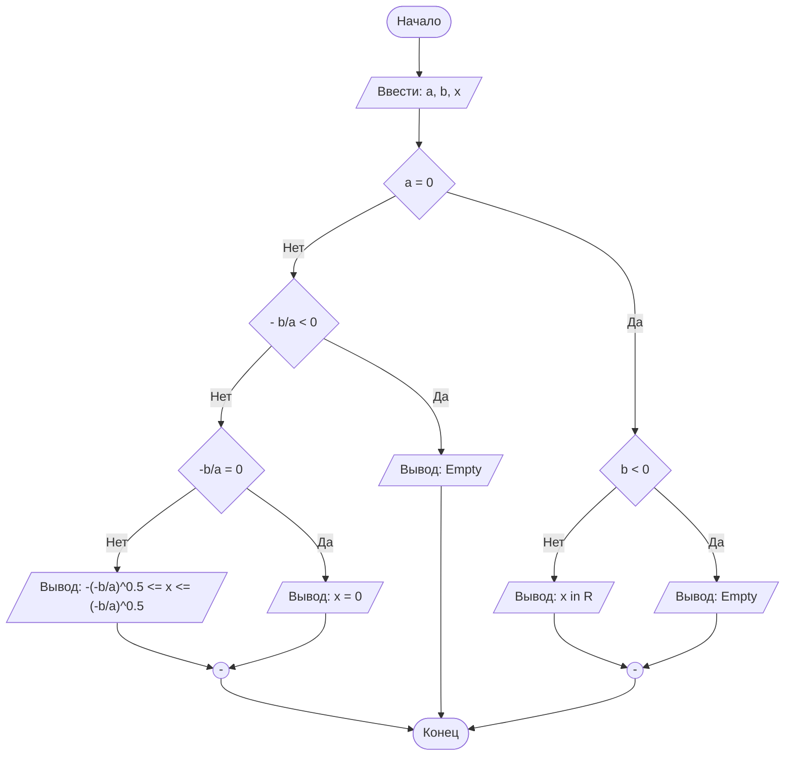

## Cодержание

1. [Отчет по лабораторной работе № 1](#отчет-по-лабораторной-работе--n)
2. [Критерии оценивания](#критерии-оценивания)

## Отчет по лабораторной работе № 1

#### № группы: `ПМ-2402`

#### Выполнил: `Корень Егор Романович`

#### Вариант: `13`

### Cодержание:

- [Постановка задачи](#1-постановка-задачи)
- [Входные и выходные данные](#2-входные-и-выходные-данные)
- [Математическая модель](#25-математическая-модель)
- [Выбор структуры данных](#3-выбор-структуры-данных)
- [Алгоритм](#4-алгоритм)
- [Программа](#5-программа)
- [Анализ правильности решения](#6-анализ-правильности-решения)

### 1. Постановка задачи


> Набор бусинок диаметрами A, B, C, D, надетый на нить, пытаются протащить в указанном порядке через отверстие диаметром X. Какое количество
бусинок удастся протащить через отверстие? На вход программы подаются
натуральные числа X, A, B, C, D

Для решения данной задачи можно последовательно проверять пройдет ли каждая из бусинок в отверстие. Если бусинка прошла,
то требуется проверять идущие за ней, если бусинка не прошла, то все идущие за ней тоже не пройдут в отверстие.
Проверять на корректность пользовательский ввод не требуется, т.к. в условии сказано, что на вход поступают только натуральные числа.

### 2. Входные и выходные данные

#### Данные на вход
На вход поступают 5 натуральных чисел, ограничения не даны.

|                       | Тип               | min значение | max значение       |
|-----------------------|-------------------|--------------|--------------------|
| x (диаметр отверстия) | Натуральное число | 1            | 2<sup>31</sup> - 1 |
| a (диаметр 1 бусинки) | Натуральное число | 1            | 2<sup>31</sup> - 1 |
| b (диаметр 2 бусинки) | Натуральное число | 1            | 2<sup>31</sup> - 1 |
| c (диаметр 3 бусинки) | Натуральное число | 1            | 2<sup>31</sup> - 1 |
| d (диаметр 4 бусинки) | Натуральное число | 1            | 2<sup>31</sup> - 1 |

Это про каждые входные данные. Затем - то же самое про выходные.
#### Данные на выход
Одно число - количество бусинок, которые прошли через отверстие

|                                                   | Тип         | min значение | max значение |
|---------------------------------------------------|-------------|--------------|--------------|
| k (число бусинок, которые прошли через отверстие) | Целое число | 0            | 4            |

### 3. Выбор структуры данных

Анализ (рассуждения) и обоснования того, где и как Вы собираетесь хранить всё то,
что нужно для работы программы.
Программа на вход получает 5 натуральных чисел, для их хранения выделим 5 переменных типа `int`
(`x` - диаметр отверстия, `a`, `b`, `c` и `d` - диаметры бусинок), еще необходимо выделить переменную `k` типа `int` для 
счетчика бусинок, которые прошли через отверстие.

|                       | название переменной | Тип (в Java) | 
|-----------------------|---------------------|--------------|
| x (диаметр отверстия) | `x`                 | `int`        |
| a (диаметр 1 бусинки) | `a`                 | `int`        | 
| b (диаметр 2 бусинки) | `b`                 | `int`        | 
| c (диаметр 3 бусинки) | `c`                 | `int`        | 
| d (диаметр 4 бусинки) | `d`                 | `int`        | 
| k (счётчик бусинок)   | `k`                 | `int`        | 

### 4. Алгоритм

На русском языке подробно расписать, что и в каком порядке делает Ваша программа.
1. **Ввод данных:**  
   Программа считывает пять натуральных чисел, обозначенные как `x`, `a`, `b`, `c` и `d`.

2. **Проверка проходит ли бусинка и вывод:**  
   Программа сравнивает `x` и `a`. Если `a` <= `x`, то к `k` прибавляется 1 и сравниваются `x` и `b`, иначе выводится `k` и программа завершается. Далее подобно описанному сравнению с `x` сравниваются `b`, `c` и `d`. (данный алгоритм лучше описывается блок схемой)


В 1 лабораторной работе блок-схем обязательна. Ниже представлен пример с лекции,
реализованный с помощью `mermaid` - инструментом для рисования диаграмм и блок-схем.

```markdown
    ```mermaid
        ([Начало]) --> B[/Ввести: a, b, x/]
        B --> C{a = 0}
        C -- Нет --> D{- b/a < 0}
        D -- Нет --> E{"-b/a = 0"}
        E -- Нет --> F[/"Вывод: -(-b/a)^0.5 <= x <= (-b/a)^0.5"/]
        E -- Да --> G[/Вывод: x = 0/]
        D -- Да --> H[/Вывод: Empty/]
        C -- Да --> I{b < 0}
        I -- Нет --> J[/Вывод: x in R/]
        I -- Да --> K[/Вывод: Empty/]
        J --> M(("-"))
        K --> M
        G --> L(("-"))
        H ----> Z
        F --> L
        M --> Z
        L --> Z([Конец])
    ``` 
```




`Mermaid` нативно интегрирован в `GitHub`, а для работы в Вашей среде разработке - нужно установить
плагин: `File` > `Settings` > `Plugins`.


### 5. Программа

Полный текст программы с комментариями на русском языке

Нужно вставить код прямо в отчет в блок:

```markdown
    ```java
        class Main{
            // Что-то далее
        }
    ``` 
```

Это будет выглядеть следующим образом:

```java
class Main{
    // Что-то далее
}
```

### 6. Анализ правильности решения

Привести тесты и анализ работы программы для этих тестов.
Очень неплохо было бы обосновать выбор тестов.

1. Тест на что-то

- Input:
    ```
    1
    1
    ```

- Output:
    ```
    2
    ```

2. Тест на что-то еще

- Input:
    ```
    1
    -1
    ```

- Output:
    ```
    0
    ```

# Критерии оценивания

Обратите внимание на то, что лабораторная работа должна быть выложена в отдельный репозиторий с названием LabN (N -
Номер лабы). В репозитории должно быть минимум 2 файла (README.md - отчет, Main.java - код лабы)

| **Критерий**                                                                                                                                                                           | **Баллы**       |
|----------------------------------------------------------------------------------------------------------------------------------------------------------------------------------------|-----------------|
| **Корректность программы**                                                                                                                                                             | **0** - **40**  |
| - Программа полностью выполняет задачу                                                                                                                                                 | 15              |
| - Нет ошибок выполнения                                                                                                                                                                | 10              |
| - Учтены все ограничения                                                                                                                                                               | 5               |
| - Правильное поведение в "крайних" случаях                                                                                                                                             | 10              |
|                                                                                                                                                                                        |                 |
| **Оптимизация кода**                                                                                                                                                                   | **0** - **20**  |
| - Эффективные алгоритмы                                                                                                                                                                | 10              |
| - Избежание избыточности и повторов                                                                                                                                                    | 5               |
| - Разумность использования структур данных                                                                                                                                             | 5               |
|                                                                                                                                                                                        |                 |
| **Читабельность и стиль кода**                                                                                                                                                         | **0** - **20**  |
| - Соблюдение стандартов форматирования                                                                                                                                                 | 5               |
| - Наличие комментариев, в полном объеме поясняющих написанный код                                                                                                                      | 10              |
| - Понятные имена переменных и функций                                                                                                                                                  | 5               |
|                                                                                                                                                                                        |                 |
| **Оформление отчета**                                                                                                                                                                  | **0** - **20**  |
| - Соблюдение структуры отчета                                                                                                                                                          | 5               |
| - Отчет загружен на GitHub в репозиторий с названием LabN (N - номер лабораторной работы), отчет в формате Markdown с названием README.md, также есть файл Main.java с кодом программы | Обязательно     |
| - Четкое описание алгоритма (блок-схема если нужна)                                                                                                                                    | 5               |
| - Полнота покрытия тестами всех случаев                                                                                                                                                | 5               |
| - Обоснования использования алгоритма, структур данных                                                                                                                                 | 5               |
|                                                                                                                                                                                        |                 |
| **Общая сумма**                                                                                                                                                                        | **0** - **100** |